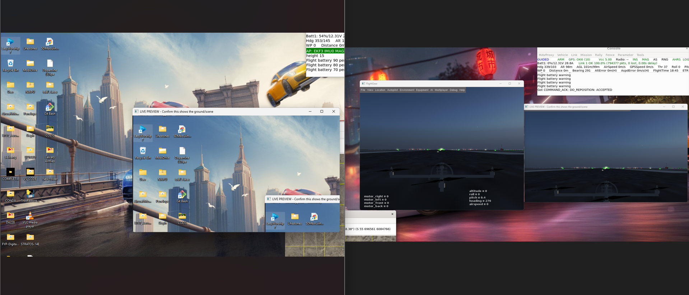

# PHI-DRONE

**An open-source simulation framework unifying ArduPilot SITL, FlightGear, and YOLOv8 into a telemetry-synchronized UAV perception pipeline.**

[](LICENSE)


PHI-DRONE connects a real flight-control firmware (ArduPilot SITL) to a 3D renderer (FlightGear), captures the rendered viewport as a synthetic camera feed, runs YOLOv8 detection on it, and fuses every detection with live GPS telemetry from MAVLink — all on a single CPU-only laptop, no GPU or commercial licenses required.

> **Scope note:** The contribution here is the **integration architecture** — making four independently-developed tools interoperate reliably across a Windows/WSL2 boundary with thread-safe telemetry-vision fusion. The bundled YOLOv8/VisDrone detector is a functional placeholder to exercise the pipeline end-to-end; it has not been benchmarked for detection accuracy (FlightGear's default scenery isn't photorealistic enough for that). See [Limitations](#limitations).

---

## Architecture


| Subsystem | Runs on | Role |
|---|---|---|
| ArduPilot SITL (ArduCopter) | WSL2 | Flight control firmware |
| FlightGear 2024.1 | Windows | 3D rendering, driven by SITL over UDP (port 5503) |
| YOLOv8n (VisDrone fine-tuned) | Windows | Object detection on captured viewport frames |
| MAVLink listener (pymavlink) | Windows, background thread | Parses GPS telemetry, fuses with detections |

FlightGear exposes no native camera API, so the viewport is treated as a synthetic camera sensor — the capture region is calculated from window geometry with calibrated pixel offsets to exclude chrome/taskbar:



---

## Validated performance

Across three missions (morning, night, dusk — 55.6 min total, 3,833 detection events):

| Metric | Morning | Night | Dusk |
|---|---|---|---|
| Median inference latency | 180.3 ms | 177.4 ms | 196.0 ms |
| 95th %ile latency | 249.0 ms | 255.2 ms | 309.9 ms |
| GPS-annotation coverage | 100% | 100% | 100% |
| Pipeline uptime (crashes/disconnects) | 100% / 0 | 100% / 0 | 100% / 0 |

GPS-fusion accuracy cross-checked against MAVProxy map markers: agreement within ~2 m, no stale-data drift observed.

---

## Interoperability issues solved

| Issue | Root cause | Fix |
|---|---|---|
| WSL2 ↔ Windows UDP blocked | Default NAT mode blocks localhost across the OS boundary | Mirrored networking mode in `.wslconfig` |
| Capture includes desktop chrome | Window geometry not queried before crop | Programmatic window-location query + calibrated pixel offsets |
| Frame capture stalls | Single-threaded blocking MAVLink reads | Telemetry moved to background daemon thread + lock-protected shared state |
| MAVLink client times out | External clients need explicit telemetry forwarding | `output add 127.0.0.1:14551` in MAVProxy |
| Log/video corruption on Ctrl+C | Cleanup code skipped on interrupt | Capture loop wrapped in `try/finally` |
| Port conflicts on rerun | Previous session leaves sockets open | Shutdown script kills all processes, releases ports |

---

## Quick start

**Prerequisites:** Windows 10/11 with WSL2 (Ubuntu 24.04, mirrored networking), FlightGear 2024.1, Python 3.11, ArduPilot built for the `sitl` board target.

1. Enable WSL2 mirrored networking — add to `C:\Users\<you>\.wslconfig`:
   ```ini
   [wsl2]
   networkingMode=mirrored
   ```
   Then `wsl --shutdown` and reopen.

2. Build ArduPilot SITL (in WSL2):
   ```bash
   git clone --recurse-submodules https://github.com/ArduPilot/ardupilot.git
   cd ardupilot
   Tools/environment_install/install-prereqs-ubuntu.sh -y
   . ~/.profile
   ./waf configure --board sitl
   ./waf copter
   ```

3. Set up Python environment:
   ```bash
   conda create -n aerospace python=3.11
   conda activate aerospace
   pip install -r requirements.txt
   ```

4. Launch (Windows):
   ```cmd
   scripts\launch_drone_sim.bat
   ```
   Type `takeoff 10` in MAVProxy and confirm FlightGear's altitude climbs in sync. Detection starts automatically, logging to `detections/session_<timestamp>/`.

---

## Repository structure

```
phi-drone/
├── scripts/
│   ├── phi_drone_detect.py       # Detection + telemetry fusion
│   ├── phi_drone_analysis.py     # Post-session metrics
│   ├── launch_drone_sim.bat      # Orchestrated startup
│   └── shutdown_drone_sim.bat    # Clean shutdown, port release
├── docs/
│   ├── Figure_1_architecture.png
│   └── Figure_8_before_after.png
├── requirements.txt
├── LICENSE                       # MIT
└── README.md
```

---

## Limitations

FlightGear's default scenery lacks photorealistic ground-object models, so the YOLOv8 detector isn't benchmarked for mAP/accuracy in this release — only pipeline throughput, latency, and telemetry-fusion integrity are validated. A formal accuracy evaluation is planned, requiring either procedurally-generated scenery (e.g. OSM2City) with placed 3D targets, or migration to a simulator with a native camera API.

---

## Citation

```bibtex
@misc{phi_drone_2026,
  author       = {{Air Force Institute of Technology, Kaduna, Nigeria}},
  title        = {Sm-bello/phi-drone: PHI-DRONE v1.0.0},
  year         = {2026},
  month        = {7},
  day          = {18},
  howpublished = {Zenodo},
  doi          = {10.5281/zenodo.21433215},
  url          = {https://doi.org/10.5281/zenodo.21433215}
}
```
*(BibTeX will be updated with volume/DOI upon acceptance.)*

## License

MIT — see [LICENSE](LICENSE).
